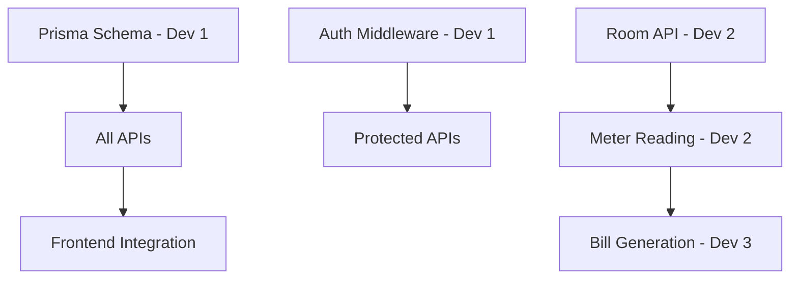

# 📋 Work Breakdown - Tim 3 Orang

> **Project:** Kos-Man Backend Implementation  
> **Duration:** ~10-12 hari kerja  
> **Team Size:** 3 Developer

---

## 👥 Pembagian Tim

| Role      | Fokus Area          | Skill Requirement      |
| --------- | ------------------- | ---------------------- |
| **Dev 1** | Database & Auth     | Prisma, JWT, Security  |
| **Dev 2** | Core Business Logic | CRUD APIs, Validation  |
| **Dev 3** | Billing & Frontend  | Business Logic, Vue.js |

---

## 📅 Timeline & Task Assignment

### Phase 1: Setup (Day 1-2)

> Paralel, semua developer setup environment

| Task                         | Assignee  | Priority  |
| ---------------------------- | --------- | --------- |
| Git branching strategy setup | **All**   | 🔴 High   |
| Install PostgreSQL lokal     | **All**   | 🔴 High   |
| Setup Prisma & schema        | **Dev 1** | 🔴 High   |
| Run initial migration        | **Dev 1** | 🔴 High   |
| Setup API folder structure   | **Dev 2** | 🟡 Medium |
| Review frontend code         | **Dev 3** | 🟡 Medium |

**Deliverable:** Database ready, project structure defined

---

### Phase 2: Auth & Base APIs (Day 3-5)

#### Dev 1 - Authentication System

| Task                         | Estimated |
| ---------------------------- | --------- |
| `POST /api/auth/register`    | 2-3 jam   |
| `POST /api/auth/login` (JWT) | 3-4 jam   |
| `POST /api/auth/logout`      | 1 jam     |
| `GET /api/auth/me`           | 1 jam     |
| Auth middleware              | 2-3 jam   |
| Password hashing (bcrypt)    | 1 jam     |
| **Settings API**             | 2 jam     |

#### Dev 2 - Property & Room APIs

| Task                         | Estimated |
| ---------------------------- | --------- |
| `GET /api/properties`        | 1-2 jam   |
| `POST /api/properties`       | 2 jam     |
| `GET /api/properties/:id`    | 1 jam     |
| `PUT /api/properties/:id`    | 2 jam     |
| `DELETE /api/properties/:id` | 1 jam     |
| Property Settings logic      | 2 jam     |
| **Room APIs (semua CRUD)**   | 4-5 jam   |

#### Dev 3 - Tenant API + Research

| Task                                   | Estimated |
| -------------------------------------- | --------- |
| `GET /api/tenants`                     | 1-2 jam   |
| `POST /api/tenants`                    | 2 jam     |
| `GET /api/tenants/:id`                 | 1 jam     |
| `PUT /api/tenants/:id`                 | 2 jam     |
| `DELETE /api/tenants/:id`              | 1 jam     |
| Research: Frontend integration pattern | 2 jam     |
| Prepare frontend API service layer     | 2 jam     |

**Deliverable:** Auth working, semua CRUD dasar selesai

---

### Phase 3: Billing System (Day 6-8)

#### Dev 1 - Support & Code Review

| Task                            | Estimated |
| ------------------------------- | --------- |
| Code review untuk Dev 2 & Dev 3 | Ongoing   |
| Fix security issues             | As needed |
| API documentation               | 3-4 jam   |
| Unit tests for auth             | 3-4 jam   |

#### Dev 2 - Meter Reading API

| Task                               | Estimated |
| ---------------------------------- | --------- |
| `GET /api/meter-readings?roomId=`  | 2 jam     |
| `POST /api/meter-readings`         | 2-3 jam   |
| `DELETE /api/meter-readings/:id`   | 1 jam     |
| Validation: meterEnd >= meterStart | 1 jam     |
| Auto-fill previous reading         | 2 jam     |

#### Dev 3 - Bill API (Core Feature)

| Task                            | Estimated |
| ------------------------------- | --------- |
| `GET /api/bills` (with filters) | 3-4 jam   |
| `POST /api/bills/generate`      | 4-5 jam   |
| Multi-month payment logic       | 3-4 jam   |
| Proration calculation           | 2-3 jam   |
| `PATCH /api/bills/:id/pay`      | 2 jam     |
| `DELETE /api/bills/:id`         | 1 jam     |

**Deliverable:** Billing system complete

---

### Phase 4: Frontend Integration (Day 9-11)

#### Dev 1 - Auth Frontend

| Task                        | Estimated |
| --------------------------- | --------- |
| Login page integration      | 2-3 jam   |
| Auth store (Pinia)          | 2 jam     |
| Protected routes middleware | 2 jam     |
| Logout flow                 | 1 jam     |

#### Dev 2 - Property & Room Frontend

| Task                                | Estimated |
| ----------------------------------- | --------- |
| Replace property localStorage → API | 3-4 jam   |
| Replace room localStorage → API     | 3-4 jam   |
| Error handling & loading states     | 2 jam     |
| Settings page integration           | 2 jam     |

#### Dev 3 - Tenant & Billing Frontend

| Task                               | Estimated |
| ---------------------------------- | --------- |
| Replace tenant localStorage → API  | 3-4 jam   |
| Replace billing localStorage → API | 4-5 jam   |
| Multi-month payment UI             | 3-4 jam   |
| Bill preview with new fields       | 2 jam     |

**Deliverable:** Frontend fully integrated with backend

---

### Phase 5: Testing & Polish (Day 12)

| Task                 | Assignee  |
| -------------------- | --------- |
| Integration testing  | **All**   |
| Bug fixes            | **All**   |
| Performance check    | **Dev 1** |
| UI polish            | **Dev 3** |
| Documentation update | **Dev 2** |

---

## 🌿 Git Branching Strategy

```
main
  └── develop
        ├── feature/auth (Dev 1)
        ├── feature/property-room (Dev 2)
        ├── feature/tenant (Dev 3)
        ├── feature/billing (Dev 3)
        └── feature/frontend-integration (All)
```

### Workflow:

1. Buat branch dari `develop`
2. Commit dengan format: `[TYPE] message`
   - `[FEAT]` - fitur baru
   - `[FIX]` - bug fix
   - `[REFACTOR]` - refactoring
3. PR ke `develop`, minta review dari 1 orang lain
4. Merge setelah approved

---

## 📞 Komunikasi

### Daily Standup (15 menit)

- Apa yang dikerjakan kemarin?
- Apa yang akan dikerjakan hari ini?
- Ada blocker?

### Sync Points

| Kapan        | Topik                     |
| ------------ | ------------------------- |
| Akhir Day 2  | Schema & migration review |
| Akhir Day 5  | API contract review       |
| Akhir Day 8  | Billing logic review      |
| Akhir Day 11 | Full integration test     |

---

## ⚠️ Dependencies & Blockers



### Critical Path:

1. **Prisma schema** harus selesai dulu → semua API bergantung
2. **Auth middleware** harus selesai → protected routes bergantung
3. **Room API** harus selesai → Meter Reading bergantung
4. **Meter Reading** harus selesai → Bill generation bergantung

---

## 📊 Summary per Developer

### Dev 1 (Auth Lead)

- 🔐 Authentication system (register, login, JWT)
- 🛡️ Security middleware
- ⚙️ Settings API
- 📝 Code review & documentation

### Dev 2 (Core APIs)

- 🏠 Property CRUD
- 🚪 Room CRUD
- ⚡ Meter Reading CRUD
- 🔗 Frontend: Property & Room

### Dev 3 (Billing + Frontend)

- 👤 Tenant CRUD
- 💰 Bill generation & payment
- 📅 Multi-month payment logic
- 🔗 Frontend: Tenant & Billing

---

**Prepared by:** AI Assistant  
**Date:** 14 Januari 2026
