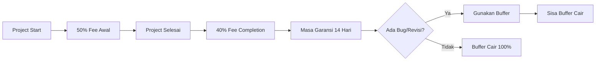

# 📊 Metodologi Penentuan Bobot Kerja (Work Weight)

> **Project:** Kos-Man Backend Implementation  
> **Purpose:** Panduan menghitung bobot kerja untuk pembagian kompensasi yang adil

---

## 🎯 Tujuan

Menentukan bobot kerja objektif untuk setiap task agar:

1. Pembagian fee/kompensasi **proporsional** dengan kontribusi
2. Transparansi dan keadilan dalam tim
3. Estimasi effort yang realistis

---

## 📐 Faktor Penilaian Bobot

Setiap task dinilai berdasarkan **5 dimensi** dengan skala 1-5:

| Dimensi                | Deskripsi                       | Skala                                      |
| ---------------------- | ------------------------------- | ------------------------------------------ |
| **Kompleksitas (K)**   | Tingkat kesulitan teknis        | 1 (simple) - 5 (sangat kompleks)           |
| **Waktu (W)**          | Estimasi durasi pengerjaan      | 1 (< 1 jam) - 5 (> 8 jam)                  |
| **Risiko (R)**         | Potensi error/bug kritis        | 1 (rendah) - 5 (tinggi)                    |
| **Dependensi (D)**     | Blocker untuk task lain         | 1 (tidak ada) - 5 (banyak task bergantung) |
| **Skill Required (S)** | Keahlian khusus yang dibutuhkan | 1 (umum) - 5 (spesialisasi tinggi)         |

---

## 🔢 Rumus Perhitungan Bobot

```
Bobot Task = (K × 2) + (W × 1.5) + (R × 1.5) + (D × 1) + (S × 1)
```

### Bobot Dimensi (Multiplier):

- **Kompleksitas × 2** — Paling berpengaruh
- **Waktu × 1.5** — Effort nyata
- **Risiko × 1.5** — Tanggung jawab tinggi
- **Dependensi × 1** — Impact ke tim
- **Skill × 1** — Keahlian khusus

**Skor Maksimum** = (5×2) + (5×1.5) + (5×1.5) + (5×1) + (5×1) = **35 poin**

---

## 📋 Contoh Penerapan - Phase 2

### Dev 1 - Authentication System

| Task                         | K   | W   | R   | D   | S   | **Bobot** |
| ---------------------------- | --- | --- | --- | --- | --- | --------- |
| `POST /api/auth/register`    | 3   | 3   | 3   | 2   | 3   | **17.5**  |
| `POST /api/auth/login` (JWT) | 4   | 4   | 4   | 4   | 4   | **25**    |
| `POST /api/auth/logout`      | 2   | 1   | 2   | 1   | 2   | **10**    |
| `GET /api/auth/me`           | 2   | 1   | 2   | 3   | 2   | **12**    |
| Auth middleware              | 4   | 3   | 5   | 5   | 4   | **26.5**  |
| Password hashing (bcrypt)    | 3   | 1   | 4   | 3   | 4   | **18**    |
| Settings API                 | 2   | 2   | 2   | 2   | 2   | **13**    |

**Total Dev 1 Phase 2:** 122 poin

---

### Dev 2 - Property & Room APIs

| Task                         | K   | W   | R   | D   | S   | **Bobot** |
| ---------------------------- | --- | --- | --- | --- | --- | --------- |
| `GET /api/properties`        | 2   | 2   | 2   | 3   | 2   | **13.5**  |
| `POST /api/properties`       | 3   | 2   | 3   | 3   | 2   | **16.5**  |
| `GET /api/properties/:id`    | 2   | 1   | 2   | 2   | 2   | **11**    |
| `PUT /api/properties/:id`    | 3   | 2   | 3   | 2   | 2   | **15.5**  |
| `DELETE /api/properties/:id` | 2   | 1   | 3   | 2   | 2   | **12.5**  |
| Property Settings logic      | 3   | 2   | 3   | 3   | 3   | **17.5**  |
| Room APIs (semua CRUD)       | 3   | 4   | 3   | 4   | 2   | **20**    |

**Total Dev 2 Phase 2:** 106.5 poin

---

### Dev 3 - Tenant API + Research

| Task                       | K   | W   | R   | D   | S   | **Bobot** |
| -------------------------- | --- | --- | --- | --- | --- | --------- |
| `GET /api/tenants`         | 2   | 2   | 2   | 3   | 2   | **13.5**  |
| `POST /api/tenants`        | 3   | 2   | 3   | 3   | 2   | **16.5**  |
| `GET /api/tenants/:id`     | 2   | 1   | 2   | 2   | 2   | **11**    |
| `PUT /api/tenants/:id`     | 3   | 2   | 3   | 2   | 2   | **15.5**  |
| `DELETE /api/tenants/:id`  | 2   | 1   | 3   | 2   | 2   | **12.5**  |
| Research frontend pattern  | 2   | 2   | 1   | 3   | 3   | **13**    |
| Frontend API service layer | 3   | 2   | 2   | 4   | 3   | **17**    |

**Total Dev 3 Phase 2:** 99 poin

---

## 📊 Rekap Bobot Total per Phase

### Phase 1: Setup (Day 1-2)

| Task                       | Assignee | K   | W   | R   | D   | S   | **Bobot**           |
| -------------------------- | -------- | --- | --- | --- | --- | --- | ------------------- |
| Git branching strategy     | All (÷3) | 2   | 1   | 2   | 4   | 2   | **13** → 4.3/orang  |
| Install PostgreSQL         | All (÷3) | 1   | 1   | 1   | 3   | 1   | **8.5** → 2.8/orang |
| Setup Prisma & schema      | Dev 1    | 4   | 3   | 4   | 5   | 4   | **25.5**            |
| Run initial migration      | Dev 1    | 2   | 1   | 3   | 5   | 3   | **16**              |
| Setup API folder structure | Dev 2    | 2   | 2   | 1   | 3   | 2   | **12**              |
| Review frontend code       | Dev 3    | 2   | 2   | 1   | 2   | 2   | **11**              |

---

### Phase 3: Billing System (Day 6-8)

| Task                       | Assignee | K   | W   | R   | D   | S   | **Bobot** |
| -------------------------- | -------- | --- | --- | --- | --- | --- | --------- |
| Code review                | Dev 1    | 3   | 3   | 3   | 2   | 3   | **17.5**  |
| Fix security issues        | Dev 1    | 4   | 2   | 5   | 2   | 4   | **21**    |
| API documentation          | Dev 1    | 2   | 3   | 1   | 2   | 2   | **12**    |
| Unit tests for auth        | Dev 1    | 3   | 3   | 3   | 2   | 3   | **17.5**  |
| Meter Reading CRUD         | Dev 2    | 3   | 4   | 3   | 4   | 2   | **20**    |
| Validation meter           | Dev 2    | 2   | 1   | 3   | 2   | 2   | **12.5**  |
| Auto-fill previous reading | Dev 2    | 3   | 2   | 3   | 2   | 3   | **16.5**  |
| Bill API with filters      | Dev 3    | 4   | 4   | 4   | 3   | 3   | **23**    |
| Bill generation            | Dev 3    | 5   | 4   | 5   | 4   | 4   | **28.5**  |
| Multi-month payment        | Dev 3    | 4   | 4   | 4   | 3   | 3   | **23**    |
| Proration calculation      | Dev 3    | 4   | 3   | 4   | 2   | 4   | **21**    |
| Pay bill endpoint          | Dev 3    | 3   | 2   | 4   | 3   | 2   | **17.5**  |
| Delete bill                | Dev 3    | 2   | 1   | 3   | 1   | 2   | **11**    |

---

## 💰 Perhitungan Pembagian Fee

### Budget Project - Struktur Lengkap

| Item                    | Opsi 1             | Opsi 2             |
| ----------------------- | ------------------ | ------------------ |
| **Total Nilai Project** | Rp 15.000.000      | Rp 15.000.000      |
| Safety Net (10%)        | Rp 1.500.000       | Rp 1.500.000       |
| Management Fee          | Rp 1.350.000 (10%) | Rp 2.025.000 (15%) |
| Deployment Fee          | Rp 1.000.000       | Rp 1.000.000       |
| **Fee Kerja Tim**       | **Rp 11.150.000**  | **Rp 10.475.000**  |

> [!IMPORTANT] > **Biaya Infrastruktur (Ditanggung Client)**
>
> Item berikut **TIDAK termasuk** dalam fee project dan dibayar langsung oleh client:
>
> - VPS/Hosting: ~Rp 100.000 - 500.000/bulan
> - Domain: ~Rp 150.000 - 300.000/tahun
> - SSL Certificate: Gratis (Let's Encrypt) atau ~Rp 500.000/tahun
> - Backup storage (opsional): ~Rp 50.000 - 100.000/bulan

---

## 🚀 Deployment Fee

### Apa yang Termasuk Deployment?

| Task                   | Deskripsi                                     | Bobot         |
| ---------------------- | --------------------------------------------- | ------------- |
| **Server Setup**       | Install dependencies, konfigurasi environment | 19            |
| **CI/CD Pipeline**     | Auto deploy dari git push                     | 17            |
| **Database Migration** | Setup production database                     | 17.5          |
| **Documentation**      | Deployment guide, credentials handover        | 10            |
| **Total**              |                                               | **63.5 poin** |

### Siapa yang Mengerjakan Deployment?

Deployment biasanya dikerjakan oleh **Dev 1 (Database & Auth Lead)** atau bisa dibagi:

| Opsi | Assignee   | Keterangan                           |
| ---- | ---------- | ------------------------------------ |
| A    | Dev 1 saja | Paling efisien, 1 orang handle semua |
| B    | Dev 1 + PM | PM bantu dokumentasi                 |
| C    | Semua      | Masing-masing deploy bagiannya       |

### Deployment Fee Distribution (Jika Dev 1 handle semua)

```
Deployment Fee: Rp 1.000.000 → 100% ke Dev 1
```

Atau jika dibagi:

| Developer | Kontribusi              | Fee        |
| --------- | ----------------------- | ---------- |
| Dev 1     | 70% (server, db, CI/CD) | Rp 700.000 |
| PM/Lead   | 30% (dokumentasi)       | Rp 300.000 |

---

## 👔 Management Fee (Project Owner)

### Apa itu Management Fee?

Management Fee adalah kompensasi untuk **Project Owner/Lead** yang bertanggung jawab atas:

| Tanggung Jawab              | Deskripsi                        |
| --------------------------- | -------------------------------- |
| 🤝 **Akuisisi Project**     | Mendapatkan client dan project   |
| 📋 **Koordinasi Tim**       | Assign task, monitor progress    |
| 💬 **Client Communication** | Meeting, demo, handling feedback |
| ✅ **Quality Assurance**    | Review code, testing akhir       |
| ⚠️ **Risk Management**      | Tanggung jawab jika ada masalah  |
| 📄 **Administrasi**         | Invoice, kontrak, dokumentasi    |

### 2 Opsi Management Fee

#### Opsi 1: Management Fee 10% (Recommended untuk tim solid)

```
Total Project:     Rp 15.000.000
├── Safety Net:    Rp  1.500.000 (10%)
├── Management:    Rp  1.350.000 (10%) ← Project Owner
└── Fee Tim:       Rp 12.150.000        ← Dibagi sesuai bobot
```

| Developer     | Bobot     | Persentase | Fee               |
| ------------- | --------- | ---------- | ----------------- |
| Dev 1         | 122       | 37.3%      | Rp 4.531.950      |
| Dev 2         | 106.5     | 32.5%      | Rp 3.948.750      |
| Dev 3         | 99        | 30.2%      | Rp 3.669.300      |
| **Total Tim** | **327.5** | **100%**   | **Rp 12.150.000** |

#### Opsi 2: Management Fee 15% (Jika workload PM tinggi)

```
Total Project:     Rp 15.000.000
├── Safety Net:    Rp  1.500.000 (10%)
├── Management:    Rp  2.025.000 (15%) ← Project Owner
└── Fee Tim:       Rp 11.475.000        ← Dibagi sesuai bobot
```

| Developer     | Bobot     | Persentase | Fee               |
| ------------- | --------- | ---------- | ----------------- |
| Dev 1         | 122       | 37.3%      | Rp 4.280.175      |
| Dev 2         | 106.5     | 32.5%      | Rp 3.729.375      |
| Dev 3         | 99        | 30.2%      | Rp 3.465.450      |
| **Total Tim** | **327.5** | **100%**   | **Rp 11.475.000** |

---

### 📊 Kapan Pilih Opsi Mana?

| Faktor                  | Opsi 1 (10%) | Opsi 2 (15%) |
| ----------------------- | ------------ | ------------ |
| Client mudah dihandle   | ✅           |              |
| Client banyak revisi    |              | ✅           |
| Anda ikut coding juga   | ✅           |              |
| Fokus koordinasi saja   |              | ✅           |
| Project straightforward | ✅           |              |
| Project kompleks        |              | ✅           |

> [!TIP] > **Jika Anda juga ikut coding**, hitung bobot kerja Anda juga dan tambahkan ke pembagian tim.
> Management fee tetap terpisah sebagai kompensasi koordinasi.

---

### 🔄 Jika Project Owner Ikut Coding

Contoh: Anda mengerjakan 30% dari task Dev 1

```
Management Fee:        Rp 1.350.000 (fixed)
Bobot Coding Anda:     36.6 poin (30% × 122)
Fee Coding Anda:       Rp 1.359.585 (dari pool tim)
────────────────────────────────────────────
Total Penghasilan:     Rp 2.709.585
```

---

### 📌 Skenario A: Safety Net 10% (Rp 1.500.000)

**Cocok untuk:**

- Scope sudah 100% fixed dan terdokumentasi
- Tim sudah pernah kerja bareng sebelumnya
- Client tidak banyak revisi
- Timeline longgar

| Developer | Bobot     | Persentase | Fee               |
| --------- | --------- | ---------- | ----------------- |
| Dev 1     | 122       | 37.3%      | Rp 5.035.500      |
| Dev 2     | 106.5     | 32.5%      | Rp 4.387.500      |
| Dev 3     | 99        | 30.2%      | Rp 4.077.000      |
| **Total** | **327.5** | **100%**   | **Rp 13.500.000** |

---

### 📌 Skenario B: Safety Net 15% (Rp 2.250.000)

**Cocok untuk:**

- Tim baru pertama kali kerja bareng
- Client kemungkinan ada revisi
- Scope masih ada grey area
- Timeline ketat (12 hari)

| Developer | Bobot     | Persentase | Fee               |
| --------- | --------- | ---------- | ----------------- |
| Dev 1     | 122       | 37.3%      | Rp 4.755.750      |
| Dev 2     | 106.5     | 32.5%      | Rp 4.143.750      |
| Dev 3     | 99        | 30.2%      | Rp 3.850.500      |
| **Total** | **327.5** | **100%**   | **Rp 12.750.000** |

---

## 🔄 Metode Pembayaran Buffer (Safety Net)

### Tahap Pembayaran



### Detail Tahap Pembayaran

| Tahap                   | Timing               | Skenario A (10%)  | Skenario B (15%)  |
| ----------------------- | -------------------- | ----------------- | ----------------- |
| **1. DP (50%)**         | Project start        | Rp 6.750.000      | Rp 6.375.000      |
| **2. Completion (40%)** | Project selesai      | Rp 5.400.000      | Rp 5.100.000      |
| **3. Buffer (10%/15%)** | Setelah masa garansi | Rp 1.350.000      | Rp 1.275.000      |
| **Total**               |                      | **Rp 13.500.000** | **Rp 12.750.000** |

> [!IMPORTANT] > **Buffer per Developer** = (Bobot Developer ÷ Total Bobot) × Total Buffer
>
> Buffer dicairkan setelah **masa garansi 14 hari** dari tanggal deployment.

---

### 📋 Aturan Penggunaan Buffer

#### ✅ Buffer BOLEH digunakan untuk:

| Kategori             | Contoh                                   |
| -------------------- | ---------------------------------------- |
| Bug fixes            | Error yang ditemukan saat testing client |
| Minor revisions      | Perubahan label, warna, posisi UI        |
| Performance tuning   | Query optimization, loading time         |
| Compatibility issues | Browser/device specific bugs             |

#### ❌ Buffer TIDAK untuk:

| Kategori        | Contoh                              |
| --------------- | ----------------------------------- |
| Fitur baru      | "Tambahkan fitur laporan PDF"       |
| Perubahan major | "Ubah flow billing jadi per-hari"   |
| Scope creep     | Request diluar document requirement |

> [!WARNING]
> Jika ada request **diluar scope**, harus dibuatkan **Change Request** terpisah dengan fee tambahan.

---

### 💸 Mekanisme Pencairan Buffer

#### Skenario 1: Tidak Ada Bug/Revisi

```
Buffer 100% cair ke developer sesuai proporsi bobot
```

| Developer     | Skenario A | Skenario B |
| ------------- | ---------- | ---------- |
| Dev 1 (37.3%) | Rp 559.500 | Rp 839.250 |
| Dev 2 (32.5%) | Rp 487.500 | Rp 731.250 |
| Dev 3 (30.2%) | Rp 453.000 | Rp 679.500 |

#### Skenario 2: Ada Bug Minor (Contoh: 40% buffer terpakai)

| Item           | Skenario A     | Skenario B       |
| -------------- | -------------- | ---------------- |
| Total Buffer   | Rp 1.500.000   | Rp 2.250.000     |
| Terpakai (40%) | Rp 600.000     | Rp 900.000       |
| **Sisa Cair**  | **Rp 900.000** | **Rp 1.350.000** |

> [!NOTE]
> Buffer yang terpakai **dibagi sesuai siapa yang mengerjakan fix**:
>
> - Jika Dev 1 yang fix bug di area Dev 2 → Dev 1 dapat kompensasi dari buffer
> - Tracking via git commit + time log

#### Skenario 3: Bug Major (Buffer Habis)

```
Buffer 100% terpakai → Developer tidak dapat bonus buffer
Jika lebih dari buffer → Diskusi tim untuk solusi
```

---

### 📊 Rekap Perbandingan Skenario

| Aspek                  | Skenario A (10%) | Skenario B (15%)    |
| ---------------------- | ---------------- | ------------------- |
| **Fee Awal Developer** | Lebih tinggi     | Lebih rendah        |
| **Risiko Developer**   | Lebih tinggi     | Lebih rendah        |
| **Buffer untuk Fix**   | Rp 1.500.000     | Rp 2.250.000        |
| **Cocok untuk**        | Tim experienced  | Tim baru            |
| **Recommended**        | Scope fixed      | Scope semi-flexible |

> [!TIP] > **Rekomendasi:** Gunakan **Skenario B (15%)** untuk project ini karena:
>
> - Tim pertama kali kerja bareng
> - Timeline 12 hari cukup ketat
> - Buffer lebih besar = peace of mind

---

## ⚖️ Panduan Scoring

### Kompleksitas (K)

| Skor | Kriteria                                               |
| ---- | ------------------------------------------------------ |
| 1    | CRUD sederhana tanpa logic                             |
| 2    | CRUD dengan validasi dasar                             |
| 3    | Logic bisnis moderate (relasi 2-3 tabel)               |
| 4    | Logic kompleks, multiple validasi, relasi banyak tabel |
| 5    | Algoritma rumit, optimasi performa, real-time          |

### Waktu (W)

| Skor | Durasi              |
| ---- | ------------------- |
| 1    | < 1 jam             |
| 2    | 1-2 jam             |
| 3    | 2-4 jam             |
| 4    | 4-8 jam             |
| 5    | > 8 jam / multi-day |

### Risiko (R)

| Skor | Kriteria                             |
| ---- | ------------------------------------ |
| 1    | Low impact jika error                |
| 2    | Minor bug, mudah diperbaiki          |
| 3    | Moderate, perlu testing extra        |
| 4    | Data sensitive, security concern     |
| 5    | Financial impact, data loss possible |

### Dependensi (D)

| Skor | Kriteria                         |
| ---- | -------------------------------- |
| 1    | Standalone, tidak block siapapun |
| 2    | 1 task lain bergantung           |
| 3    | 2-3 task bergantung              |
| 4    | 4+ task bergantung               |
| 5    | Critical path, semua bergantung  |

### Skill Required (S)

| Skor | Kriteria                                  |
| ---- | ----------------------------------------- |
| 1    | Junior bisa handle                        |
| 2    | Basic web development                     |
| 3    | Perlu pemahaman framework                 |
| 4    | Spesialisasi (security, database design)  |
| 5    | Expert level (optimization, cryptography) |

---

## 📝 Template Scoring Sheet

```markdown
## [Nama Phase/Task Group]

| Task   | K   | W   | R   | D   | S   | Bobot | Assignee |
| ------ | --- | --- | --- | --- | --- | ----- | -------- |
| Task 1 | ?   | ?   | ?   | ?   | ?   | ?     | Dev ?    |
| Task 2 | ?   | ?   | ?   | ?   | ?   | ?     | Dev ?    |

**Subtotal:** [X] poin
```

---

## 🔄 Review & Adjustment

1. **Tim Review** — Scoring dilakukan bersama, bukan sepihak
2. **Calibration** — Bandingkan task serupa untuk konsistensi
3. **Buffer** — Tambah 10-20% untuk unexpected issues
4. **Retrospective** — Evaluasi akurasi scoring setelah project selesai

---

## ✅ Checklist Sebelum Finalisasi Bobot

- [ ] Semua task sudah di-score
- [ ] Tim sudah review dan setuju
- [ ] Perbandingan antar task masuk akal
- [ ] Total sudah dikalkulasi per developer
- [ ] Persentase pembagian sudah disepakati

---

**Prepared by:** AI Assistant  
**Date:** 15 Januari 2026  
**Version:** 1.0
